  

 

### 🧑‍💻 About Me

I'm a **Software Engineer** specializing in building high-performance, scalable backend and data systems. I enjoy bridging the gap between raw data and actionable engineering.

- 🔭 **Currently**: Software Engineer L-3 @ [**Fin.com**](https://www.fin.com)
  - Developing infrastructure for global money movement.
  - From December 2025 to Present
- 🏗️ **Previously**: Data Engineer L-2 @ [**Pathao**](https://www.pathao.com)
  - Architected data products for South Asia's leading Consumer Tech super app.
  - From October 2022 to December 2025
- 🎯 **Focus**: Distributed Systems, Data Engineering, & AI/ML
- 💬 **Lets Talk About**: Go, SQL optimization, and building resilient data pipelines
- 🚀 Check out my [Resume](https://ashababnoor.github.io) and [LinkedIn](https://linkedin.com/in/ashababnoor) for more details.

### 🛠️ Tech Stack

<table align="center">
  <tr>
    <td align="left" width="50%" valign="top">
      <h4>💻 Languages</h4>
      
      
      
      
      
      
      
      
    </td>
    <td align="left" width="50%" valign="top">
      <h4>🗄️ Databases & Storage</h4>
      
      
      
      
      
    </td>
  </tr>
  <tr>
    <td align="left" width="50%" valign="top">
      <h4>📊 Data & Analytics</h4>
      
      
      
      
      
      
    </td>
    <td align="left" width="50%" valign="top">
      <h4>☁️ Cloud & DevOps</h4>
      
      
      
      
      
    </td>
  </tr>
  <tr>
    <td align="left" width="50%" valign="top">
      <h4>🚀 Messaging & Streaming</h4>
      
      
      
    </td>
    <td align="left" width="50%" valign="top">
      <h4>🛠️ Tools & Environments</h4>
      
      
      
      
      
    </td>
  </tr>
</table>

### 📊 GitHub Dashboard

  

### 🤝 Connect With Me

